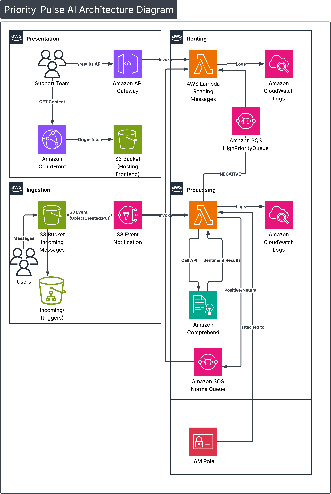
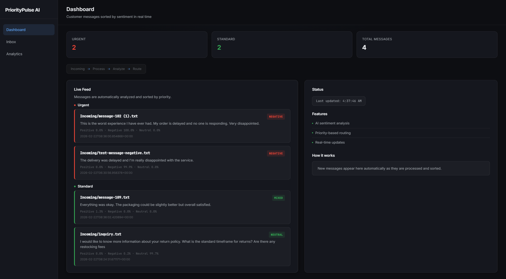

# 🚀 PriorityPulse-AI

A fully serverless, event-driven Smart Inbox built on AWS that automatically analyzes customer messages sentiment and routes urgent messages in real time.

---

## 📌 Overview

**PriorityPulse-AI** is a production-style AWS serverless architecture that:

- Accepts customer messages as `.txt` uploads to Amazon S3
- Automatically triggers AWS Lambda via S3 event notifications
- Uses Amazon Comprehend to detect sentiment
- Routes messages into priority-based Amazon SQS queues
- Exposes a `/results` API endpoint
- Displays real-time AI results via a CloudFront-hosted dashboard

This project demonstrates:

- Event-driven architecture
- Serverless design patterns
- AI integration using Amazon Comprehend
- Decoupled messaging with SQS
- Secure IAM role-based access control
- Real-time dashboard integration

---

# 🏗 Architecture Overview

<p align="center">
  
</p>

The system is built using four logical layers:

## 1️⃣ Ingestion Layer

- User uploads `.txt` file to:
  ```
  S3 Bucket: smart-inbox-incoming-message
  Prefix: incoming/
  ```
- The S3 **bucket** is configured with an event notification:
  ```
  Event: ObjectCreated
  Prefix filter: incoming/
  Suffix filter: .txt
  ```
- This triggers:
  ```
  Lambda: SentimentAnalyzerFunction
  ```

---

## 2️⃣ Processing Layer

The `SentimentAnalyzerFunction` Lambda:

- Reads file from S3
- Calls Amazon Comprehend `DetectSentiment`
- Receives classification:
  - POSITIVE
  - NEGATIVE
  - NEUTRAL
  - MIXED
- Builds structured JSON payload
- Sends message to appropriate SQS queue

---

## 3️⃣ Routing Layer

Sentiment-based routing logic:

| Sentiment | Destination |
|------------|-------------|
| NEGATIVE | HighPriorityQueue |
| POSITIVE | NormalQueue |
| NEUTRAL | NormalQueue |
| MIXED | NormalQueue |

This decouples ingestion from consumption and ensures urgent complaints are prioritized.

---

## 4️⃣ Results API Layer

Frontend does **not** directly read SQS.

Instead:

```
CloudFront → API Gateway (/results)
              ↓
     SmartInboxResultsReader Lambda
              ↑
     Reads from both SQS queues
```

The `SmartInboxResultsReader` Lambda:
- Reads messages from both queues
- Returns structured JSON
- Provides real-time updates to the dashboard

---

## 5️⃣ Presentation Layer

Frontend is hosted on:

```
S3 (smart-inbox-frontend-<name>)
CloudFront Distribution
```

The dashboard:
- Fetches `/results` every 5 seconds
- Displays sentiment classification
- Shows confidence scores
- Highlights high-priority complaints

---

# 🖥 Dashboard Preview

<p align="center">
  
</p>

---

# 🧠 AWS Services Used

| Service | Purpose |
|----------|----------|
| Amazon S3 | File storage (Inbox + Frontend hosting) |
| AWS Lambda | Sentiment processing & results reading |
| Amazon Comprehend | AI sentiment analysis |
| Amazon SQS | Message routing & decoupling |
| Amazon API Gateway | REST API endpoint |
| Amazon CloudFront | CDN for frontend |
| AWS IAM | Secure execution roles |
| Amazon CloudWatch | Logs & monitoring |

---

# 🔐 IAM Permissions

Lambda execution role includes:

- `s3:GetObject`
- `s3:PutObject`
- `s3:DeleteObject`
- `comprehend:DetectSentiment`
- `sqs:SendMessage`
- `sqs:ReceiveMessage`
- `logs:*`

---

# 📈 Scalability & Design Benefits

- Fully serverless architecture
- Lambda auto-scales with concurrent uploads
- SQS absorbs traffic spikes
- Decoupled producer-consumer model
- Pay-per-use cost efficiency
- Minimal operational overhead

---


